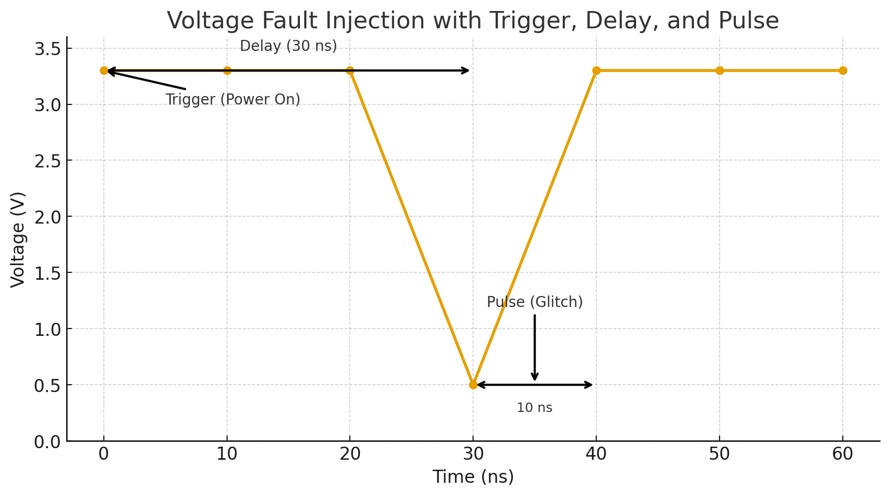
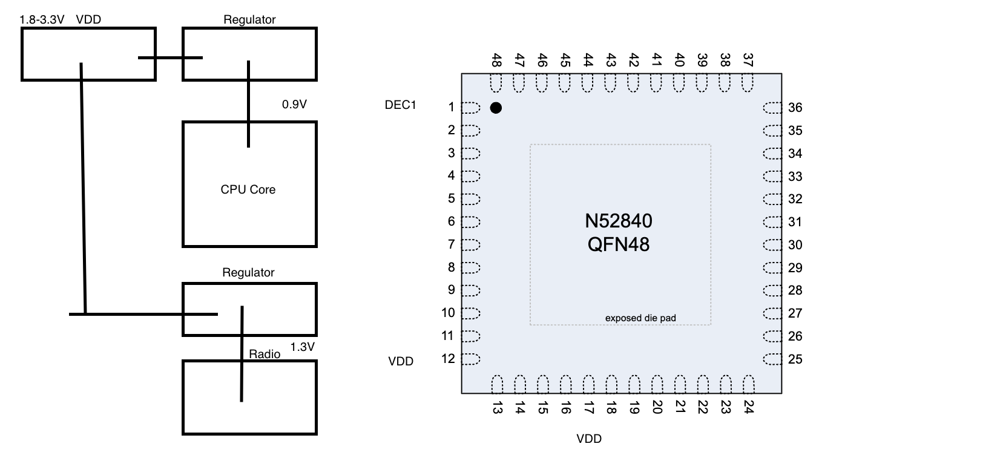
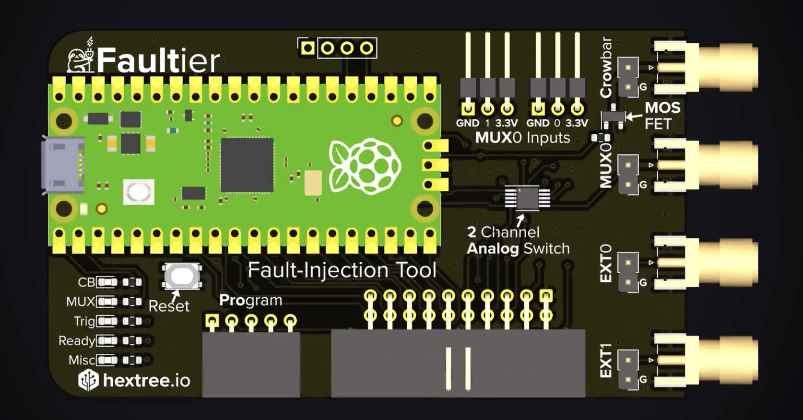

# Fault Injection

## Voltage Fault Injection

### What is Voltage Fault Injection
Voltage fault injection is a hardware attack technique where an attacker momentarily alters the supply voltage to induce faults in a system’s execution, often to bypass security checks or extract sensitive data.


```
bool pw_valid = password_check();
if (pw_valid) { // is 0 if false, 1 if true
  // ... sensitive operation
  printf("Your MFA Code is " + generate_auth_code());
}
```

In the example above, the boolean pw_valid is essentially a bit-flip. If we can corrupt this through voltage glitching it is possible to bypass the security check!


What can we do with Voltage Glitching?
- Gain access to debugging features on locked chips
- Bypass secure boot
- Code execution

### Anatomy of a Voltage Glitch

Here we have:
* trigger - device becomes powered
* delay - the time from trigger until the voltage drop
* pulse length - the time we drop the voltage

There are other parameters, such as pulse strength/amplitude, that are usable however are out of scope for this exercise.

### Glitching the nrfn52840
First we must provide a quick lesson in PCB architecture around chips like the nrfN52. These types of chips receive power through VDD, Voltage Drain Drain. In some instances it is possible to perform voltage fault injection by
pulsing here, however with this particular chip this is not ideal. Performing the glitch here would result in affecting other subsystems of the chip such as the radio and other voltage regulators, while we would like to isolate
the CPU core. By analyzing the chips data sheet, we can see that decoupling capacitor DEC1 has a link to the CPU core. If we perform the glitch here it will only affect the CPU core. 



We will be using the Faultier, a raspberry pi pico-based fault injection platform, Hextree's GlitchTag, a breakout board of the nrfN52840qfn48 that provides easy access to DEC1 on the chip, and some jumper wires.
The Faultier uses an n-channel MOSFET to perform the pulse by short-circuiting DEC1 to ground in what is called a "crow-bar" attack.



The important inputs from the faultier will be:
* Crowbar - we attach this to DEC1 and the MOSFET that after receiving a gate signal will be switched to ground, short circuiting and performing the glitch
* MUX0 - this is what we will use as the trigger to power on and off the device

### Glitch Tag
As mentioned above we will be glitching the nRF52840. The nRF52840 is a System-on-Chip (SoC) designed by Nordic Semiconductor for short-range wireless applications, featuring a multiprotocol 2.4 GHz radio and an ARM® Cortex™-M4F CPU. It supports a wide array of wireless protocols, including Bluetooth Low Energy (BLE), Thread, Zigbee, ANT, and proprietary 2.4 GHz, and is known for its advanced peripherals, ample memory (1MB Flash, 256KB RAM), and integrated security features like a cryptographic accelerator. Here is the code we will be flashing to the chip. It is simple deterministic code that **should** result in printing N at the end of all the nested loops. However, if we can successfully glitch the target, we will see "X" printed along with the flag.  

``` python
#define LOOP_LENGTH 100
void glitch_target() {
    // R - Indicates device has reset
    print_uart("R");
    
    // generate a short trigger signal on gpio2
    gpio_pin_set_dt(&trigger, 1);
    k_msleep(10);
    gpio_pin_set_dt(&trigger, 0);

    uint32_t cnt = 0, i, j;
    for (i = 0; j < LOOP_LENGTH, j++) {
        cnt++;
    }

    if (i != LOOP_LENGTH || j != LOOP_LENGTH
        || cnt != (LOOP_LENGTH * LOOP_LENGTH)) {
            // X = Success!
        print_uart("X");
        print_uart("HXT{...}");
    } else {
        // N = Normal execution
        print_uart("N");
    }
    // endless loop
    while(1) {}
}
```


## Hardware - Where to start
### Ben Eater
[eater.net](www.eater.net) - Kits and youtube videos for projects like building an 8-bit cpu from scratch or building a 6502 computer. The kits aren't a must have as you can get the knowledge from the videos, but it's definitely more fun to follow along.

### Crash Course Electronics
[Udemy Course](https://www.udemy.com/course/crash-course-electronics-and-pcb-design/?srsltid=AfmBOorrtNh4VHD76pC0CA97oJpo50Uuuy2pXfVqY6PDlIDBjmBK3zNq&couponCode=KEEPLEARNING)

From Ohm's law and transistor logic to PCB design, learn the physics behind how electronics function.

### Hextree
[hextree.io](www.hextree.io) - Cyber Security skills courses

This is where I learned more about fault injection and most of the material for this class comes from.

## Voltage Glitch Attacks
- [Hacking the Trezor-One Crypto Wallet](https://www.youtube.com/watch?v=dT9y-KQbqi4)
- [Hacking the Apple AirTag](https://www.youtube.com/watch?v=_E0PWQvW-14)

## Misc
### Building new Faultier
``` bash
docker run -d -it --name pico-sdk --mount type=bind,source=${PWD},target=/home/dev lukstep/raspberry-pi-pico-sdk:latest                                                                                14:09:58
docker exec -it pico-sdk /bin/sh
cd /home/dev
mkdir build
cd build
cmake .. && make -j4
```
