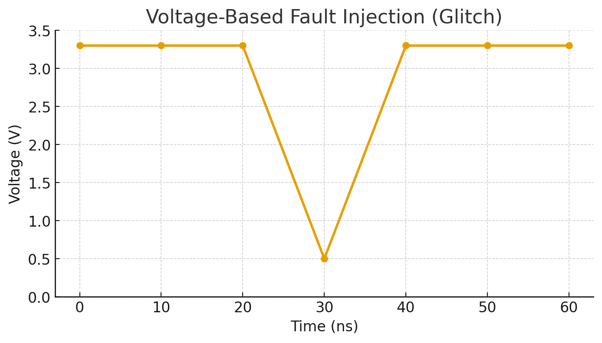

# Fault Injection

## Voltage Fault Injection

### What is Voltage Fault Injection
Voltage fault injection is a hardware attack technique where an attacker momentarily alters the supply voltage to induce faults in a system’s execution, often to bypass security checks or extract sensitive data.



```
bool pw_valid = password_check();
if (pw_valid) { // is 0 if false, 1 if true
  // ... sensitive operation
  printf("Your MFA Code is " + generate_auth_code());
}
```

In the example above, the boolean pw_valid is essentially a bit-flip. 


What can we do with Voltage Glitching?
- Gain access to debugging features on locked chips
- Bypass secure boot
- Code execution

## Hardware - Where to start
### Ben Eater
[eater.net](www.eater.net) - Kits and youtube videos for projects like building an 8-bit cpu from scratch or building a 6502 computer. The kits aren't a must have as you can get the knowledge from the videos, but it's definitely more fun to follow along.

### Crash Course Electronics
[Udemy Course](https://www.udemy.com/course/crash-course-electronics-and-pcb-design/?srsltid=AfmBOorrtNh4VHD76pC0CA97oJpo50Uuuy2pXfVqY6PDlIDBjmBK3zNq&couponCode=KEEPLEARNING)

From Ohm's law and transistor logic to PCB design, learn the physics behind how electronics function.

### Hextree
[hextree.io](www.hextree.io) - Cyber Security skills courses

This is where I learned more about fault injection and most of the material for this class comes from.
